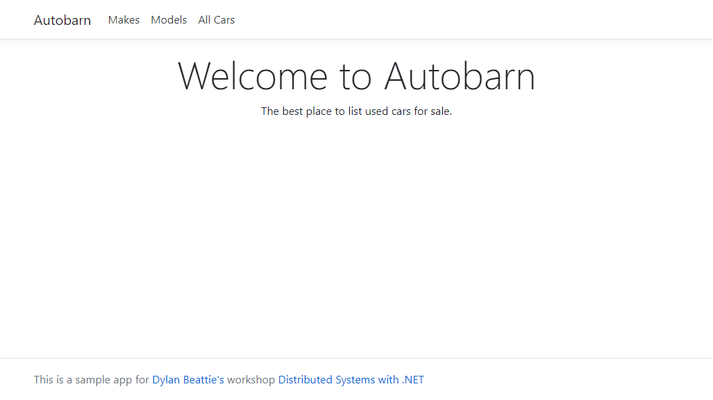

# Introduction to Distributed Systems with C# and .NET
This repo contains the sample application for Dylan Beattie's workshop on distributed systems with .NET. It's an Asp.NET Core web application based on very simple data model for advertising used cars for sale.

### Links and Resources

This repository is at **[https://github.com/ursatile/dsnet-ndc-oslo-2021](https://github.com/ursatile/dsnet-ndc-oslo-2021)**

The workshop handbook is online at **[https://ursatile.github.io/dsnet/](https://ursatile.github.io/dsnet/)**

The live examples we’ll be running during the workshop will be available at:

**[https://workshop.ursatile.com:5001/](https://workshop.ursatile.com:5001/)**

*(Don’t panic - there’s nothing there until we’re actually running the workshop.)*

### Tools

The Postman API client we’re using is available at [https://www.postman.com/downloads/](https://www.postman.com/downloads/)

The Microsoft .NET SDK is available at:

[https://dotnet.microsoft.com/download/visual-studio-sdks](https://dotnet.microsoft.com/download/visual-studio-sdks)

> *(The sample code here will run on .NET Core 3.1 with no modifications. If you want to run it on .NET 5 or .NET 6 you’ll need to make a few small changes to the project files.)*


## Getting Started


Run the `Autobarn.Website` project. *(The sample projects are configured for .NET 5.0, but will run on .NET Core 3.1 or Framework 4.6 if you modify the .csproj files to change the project targets - see below)*

```
cd dotnet
cd Autobarn.Website
dotnet run
```

Browse to [http://localhost:5000](http://localhost:5000) and you should see the Autobarn homepage:



Click the "All Cars" link (or go to http://localhost:5000/vehicles) and you should see a long list of car registration numbers.

Running RabbitMQ using Docker

As part of the workshop, we'll add some message queueing and publish/subscribe behaviour using EasyNetQ, which uses RabbitMQ as a message broker.

The code is set up to talk to a local RabbitMQ image using default credentials. To run RabbitMQ using Docker:

```bash
docker run -d --hostname rabbitmq --name rabbitmq -p 8080:15672 -p 5672:5672 -e RABBITMQ_DEFAULT_USER=user -e RABBITMQ_DEFAULT_PASS=pass rabbitmq:3-management
```

*(Note that RabbitMQ uses the hostname internally to store data, so it's important to specify the same hostname each time you start the container if you want your queues to persist between container instances.)*

### Changing the .NET Target Version

You'll need to edit `Autobarn.Website\Autobarn.Website.csproj` and `Autobarn.Data\Autobarn.Data.csproj`

Find the line:

`<TargetFramework>net5.0</TargetFramework>`

To run on .NET Framework 4.6, change this to: `<TargetFramework>net46</TargetFramework>`

To run on .NET Core 3.1, change this to: `<TargetFramework>netcoreapp3.1</TargetFramework>`

(You can see a full list of .NET versions and target frameworks at [https://docs.microsoft.com/en-us/dotnet/standard/frameworks](https://docs.microsoft.com/en-us/dotnet/standard/frameworks))

### Using MS SQL Server

By default, Autobarn uses an in-memory database. You can also run Autobarn using an MS SQL Server database that's available as a Docker container image. Run the Docker image using:

```
docker run -p 1433:1433 -d ursatile/ursatile-workshops:autobarn-mssql2019-latest
```

Then change `DatabaseMode` to `sql` in `Autobarn.Website\appsettings.json`

